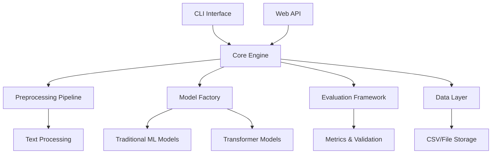

# Architecture Documentation

## System Overview

Sentiment Analyzer Pro is a comprehensive sentiment analysis toolkit built with Python, designed for scalability, maintainability, and extensibility.

## Architecture Principles

- **Modular Design**: Clear separation of concerns with dedicated modules for preprocessing, modeling, evaluation, and web serving
- **Extensibility**: Plugin-based architecture for adding new models and features
- **Performance**: Optimized for both training and inference workloads
- **Security**: Input validation, secure dependency management, and safe deployment practices

## System Components

### Core Components

### Data Flow

1. **Input Processing**: Raw text → Preprocessing Pipeline → Cleaned Features
2. **Model Training**: Training Data → Model Factory → Trained Models
3. **Prediction**: Input Text → Preprocessing → Model → Prediction
4. **Evaluation**: Test Data → Models → Metrics & Reports

### Module Architecture

#### Core Modules (`src/`)
- **cli.py**: Command-line interface and argument parsing
- **webapp.py**: Flask web server for API endpoints
- **config.py**: Configuration management and validation
- **preprocessing.py**: Text cleaning and feature extraction
- **models.py**: Model implementations and factory patterns
- **train.py**: Training orchestration and pipeline
- **predict.py**: Inference engine and batch processing
- **evaluate.py**: Model evaluation and cross-validation
- **metrics.py**: Performance metrics and reporting
- **schemas.py**: Data validation and type definitions

#### Advanced Features
- **aspect_sentiment.py**: Aspect-based sentiment analysis
- **transformer_trainer.py**: BERT/Transformer fine-tuning
- **model_comparison.py**: Comprehensive model benchmarking

### Technology Stack

#### Core Dependencies
- **Python 3.9+**: Runtime environment
- **scikit-learn**: Traditional ML algorithms
- **pandas/numpy**: Data manipulation and numerical computing
- **nltk**: Natural language processing utilities
- **pydantic**: Data validation and settings management

#### Optional Dependencies
- **transformers/torch**: Transformer model support
- **flask**: Web API framework
- **pytest**: Testing framework

### Security Architecture

- **Input Validation**: All user inputs validated through Pydantic schemas
- **Dependency Security**: Regular security updates and vulnerability scanning
- **Secret Management**: No hardcoded secrets, environment-based configuration
- **API Security**: Rate limiting and input sanitization for web endpoints

### Deployment Architecture

#### Development
- Local development with virtual environments
- Docker containerization for consistent environments
- Pre-commit hooks for code quality

#### Production
- Container-based deployment
- Health check endpoints
- Monitoring and logging integration
- Scalable inference serving

### Performance Considerations

- **Memory Management**: Efficient model loading and caching
- **Batch Processing**: Optimized for large dataset processing
- **Model Serving**: Fast inference with pre-loaded models
- **Resource Optimization**: CPU/GPU utilization strategies

### Extensibility Points

1. **Model Plugins**: Easy addition of new model types
2. **Preprocessing Hooks**: Custom text processing pipelines
3. **Metrics Extensions**: Custom evaluation metrics
4. **Data Sources**: Multiple input format support

## Decision Records

See `docs/adr/` directory for detailed architectural decisions and their rationale.